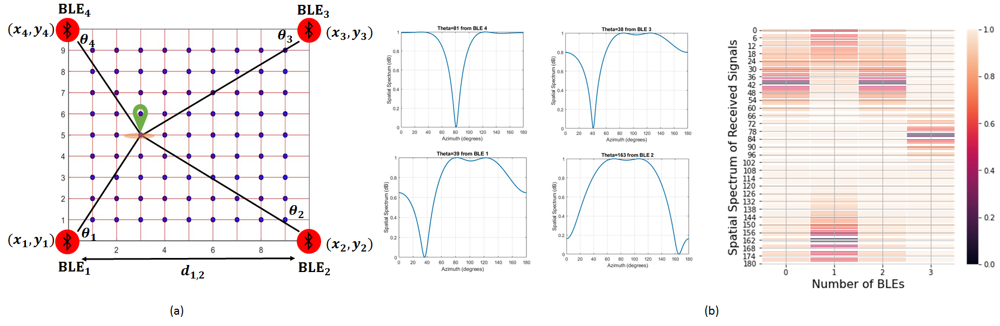

# README #

This README would normally document the content of the Comvest website. 




### What is this repository for? ###

* Quick summary
* Version
* [Learn More about i-sip](http://i-sip.encs.concordia.ca/)


### Materials Covered Here ###
- [About the Project](#About-the-Project)
- [About The Dataset](#About-The-Dataset)
- [Data Extraction](#Data-Extraction)
- [Database Configuration](#Database-Configuration)
- [Data Cleansing and Normalization](#Data-Cleansing-and-Normalization)
- [Indoor Localization and Proximity Estimation](#Indoor-Localization-and-Proximity-Estimation)
- [Loading Results on Blockchain](#Loading-Results-on-Blockchain)
- [Work with BSCT Library](#Work-with-BSCT-Library)


## About The Project - Blockchain-Based Smart Contact Tracing (BSCT)
A data pipeline for Smart Contact Tracing using blockchain in order to store the proximity of the users in an indoor environement.
- EXTRACT: In this data pipeline the proximity of the users' data is extracted form their handheld mobile devices. This data consist of BLE AoA data and UWB data received from the user devices in an environment.
Based on this extracted data the proximity of the users in an environment will be calculated. 
- TRANSFORM: This section is responsible for calculation of the proximity of the users based on the extracted data, e.g., AoA and UWB. Based on the indoor localization applied to these data and the location estimation made for each user, the proximity of the users will be defined and saved to the central database.
This proximity data based on the defined criteria will be categorized into three types:
- 1- immediate: for the users with the distance less than 1 meters.
- 2- near: for the users with the distance between 1 to 5 meters.
- 3- near: for the users with the distance more than 5 meters.

These extracted data will accompanied with the users id will be fed into the blockchain, to keep it secure and  data cannot be altered or deleted. Since the users with immediate and near proximity are able to infect others, the data of these proximity will be kept on the blockchain.


## About The Dataset
In order to prepare the data for the localization purposes, we simulate the AoA and UWB data. Our environment assumed to be an 20 meters to 10 meters indoor environment. The maximum number of users considered to walk through this indoor environment can be set in the application, but it is assumed to be a maximum of 50 persons. 
the test will be held in 21 days. This parameters can also be redifned based on your preferences in the application. A random number of the users (between 10 to 50 persons) will walk in the indoor venue and the localization data of each user is calculated, and along with the data and the time and their ids will be saved into the database. This data base and the credentials related to it ought to be redefined for the users who want to test the system.
There are 4 different tables defined in the postgresql database which are responsible to save the users data.
- users table: The data of the users are saved into the users table.
- locations table: This table save the localization of the users walking in the environment in different days and time domains.
- proximity table: The proximity status of the users will be saved in this data based on three categories: immediate, near and far
- Covid_affected table: If a user is infected by the Covid-19, its data will be saved in this table. Only those who have the necessary credentials are able to feed the data and check for the results. The system will be sent an alarm for the users who were immediate or near to the infected user in previous fourteen days.


## Indoor Localization and Proximity Estimation
- AoA-based localization:
Bluetooth Low Energy (BLE) is one of the key technologies empowering the Internet of Things (IoT) for indoor positioning. In this
regard, Angle of Arrival (AoA) localization is one of the most reliable techniques because of its low estimation error. BLE-based AoA
localization, however, is in its infancy as only recently direction-finding feature is introduced to the BLE specification. Furthermore,
AoA-based approaches are prone to noise, multi-path, and path-loss effects. In this project we proposes an efficient approach for indoor localization framework to tackle these 
issues specific to BLE-based settings. We consider indoor environments without presence of Line of Sight (LoS) links affected by Additive White Gaussian Noise (AWGN) with different Signal to Noise
Ratios (SNRs) and Rayleigh fading channel. Moreover, by assuming a 3-D indoor environment, the destructive effect of the elevation
angle of the incident signal is considered on the position estimation.
The effectiveness of the proposed framework is evaluated via an experimental testbed, where In-phase/Quadrature (I/Q) samples, modulated by Gaussian Frequency Shift Keying (GFSK), are
collected by different BLE beacons. Simulation results corroborate effectiveness of the proposed CNN-based AoA technique to track mobile agents with high accuracy in the presence of noise and Rayleigh
fading. 

- UWB-based localization:


- Fusion Approach:
The fusion of the above approaches then will be employed 
## Data Extraction
The data extraction process consist of different steps mainly focus on the determining the users' location in the environment. The tables users and locations are created in this section. As can be seen in the below figures the data related to each user and their location based on the date, time and their id is saved in the locations table.
The position data is calculated based on the localization framework comprehensively discussed in both in this repository and the related paper.


## Database Configuration
Please consider this important note that you should be able to connect to your postgresql. Use the guidance here: https://github.com/MSBeni/SmartContactTracing_Chained/blob/master/chainedSCT/extraction/README.md


## Data Cleansing and Normalization


## Indoor Localization and Proximity Estimation


## Loading Results on Blockchain


## Work with BSCT Library


### Exporting your tables into a csv file:

simply use this command to connect to your database:
```bash
$ psql --dbname=pyapp --password
```
then you can simply run this command to save the table in your preferable address:
```bash
\copy locations TO 'YOUR_ADDRESS/locations.csv' DELIMITER ',' CSV HEADER;
```