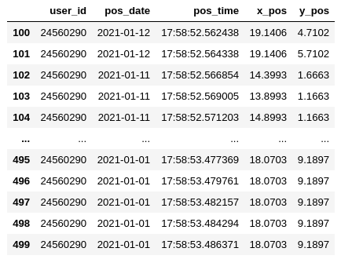

# TB-ICT #

### A Trustworthy Blockchain-Enabled System for Indoor COVID-19 Contact Tracing
This README would normally document the content of the TB-ICT blockchain-based indoor  CT framework website. 


### What is this repository for? ###

* Quick summary
* Version
* [Learn More about i-sip](http://i-sip.encs.concordia.ca/)


### Materials Covered Here ###
- [About the Project](#About-the-Project)
- [Library Installation](#Library-installation)
- [About The Dataset](#About-The-Dataset)
- [Data Extraction](#Data-Extraction)
- [Database Configuration](#Database-Configuration)
- [Data Cleansing and Normalization](#Data-Cleansing-and-Normalization)
- [Indoor Localization and Proximity Estimation](#Indoor-Localization-and-Proximity-Estimation)
- [Loading Results on Blockchain](#Loading-Results-on-Blockchain)
- [Work with BSCT Library](#Work-with-BSCT-Library)


## About The Project - Blockchain-Based Smart Contact Tracing (BSCT)
A data pipeline for Smart Contact Tracing using blockchain in order to store the proximity of the users in an indoor environment.
- EXTRACT: In this data pipeline the proximity of the users' data is extracted form their handheld mobile devices. This data consist of BLE AoA data and UWB data received from the user devices in an environment.
Based on this extracted data the proximity of the users in an environment will be calculated. 
- TRANSFORM: This section is responsible for calculation of the proximity of the users based on the extracted data, e.g., AoA and UWB. Based on the indoor localization applied to these data, and the location estimation made for each user, the proximity of the users will be defined and saved to the central database.
This proximity data based on the defined criteria will be categorized into three types:
- 1- immediate: for the users with the distance less than 1 meters.
- 2- near: for the users with the distance between 1 to 5 meters.
- 3- near: for the users with the distance more than 5 meters.

These extracted data will be accompanied by the users' id will be fed into the blockchain, to keep it secure and  data cannot be altered or deleted. Since the users with immediate and near proximity are able to infect others, the proximity data will be kept on the blockchain.


## Library Installation
You can simply install this library () using the command:
```bash
pip install chainedSCT==0.0.1
```
In order to be aware of how to work with BSCT Library, please check 

## About The Dataset
In order to prepare the data for the localization purposes, we simulate the AoA and UWB data. Our environment assumed to be an 20 meters to 10 meters indoor environment. The maximum number of users considered to walk through this indoor environment can be set in the application, but it is assumed to be a maximum of 50 persons. 
the test will be held in 21 days. These parameters can also be redefined based on your preferences in the application. A random number of the users (between 10 to 50 persons) will walk in the indoor venue and the localization data of each user is calculated, and along with the data and the time and their ids will be saved into the database. This data base and the credentials related to it ought to be redefined for the users who want to test the system.
There are 4 different tables defined in the postgresql database which are responsible to save the users data.
- users table: The data of the users are saved into the users table.
- locations table: This table save the localization of the users walking in the environment in different days and time domains.
- proximity table: The proximity status of the users will be saved in this data based on three categories: immediate, near and far
- Covid_affected table: If a user is infected by the Covid-19, its data will be saved in this table. Only those who have the necessary credentials are able to feed the data and check for the results. The system will be sent an alarm for the users who were immediate or near to the infected user in previous fourteen days.


## Indoor Localization and Proximity Estimation
- AoA-based localization:
Bluetooth Low Energy (BLE) is one of the key technologies empowering the Internet of Things (IoT) for indoor positioning. In this
regard, Angle of Arrival (AoA) localization is one of the most reliable techniques because of its low estimation error. BLE-based AoA
localization, however, is in its infancy as only recently direction-finding feature is introduced to the BLE specification. Furthermore,
AoA-based approaches are prone to noise, multi-path, and path-loss effects. In this project we proposes an efficient approach for indoor localization framework to tackle these 
issues specific to BLE-based settings. We consider indoor environments without presence of Line of Sight (LoS) links affected by Additive White Gaussian Noise (AWGN) with different Signal to Noise
Ratios (SNRs) and Rayleigh fading channel. Moreover, by assuming a 3-D indoor environment, the destructive effect of the elevation
angle of the incident signal is considered on the position estimation.
The effectiveness of the proposed framework is evaluated via an experimental testbed, where In-phase/Quadrature (I/Q) samples, modulated by Gaussian Frequency Shift Keying (GFSK), are
collected by different BLE beacons. Simulation results corroborate effectiveness of the proposed CNN-based AoA technique to track mobile agents with high accuracy in the presence of noise and Rayleigh
fading. 

- UWB-based localization:
Sequences of short time-domain impulses transmit over a high-bandwidth radio spectrum in the Impulse Radio UWB (IR-UWB)
 technology, resulting in an improvement in data rate and localization accuracy for short-range communication. 
In this project, the UWB data is simulated for the users in the indoor environment and in a fusion approach
the localization of the users in an indoor environment is made. 
The original bit stream is modulated based on the Pulse Amplitude Modulation (PAM) method, which is known as one of the 
efficient IR-UWB modulation schemes. 

- Fusion Approach:
The fusion of the above approaches then will be employed to calculate the exact location of the user.
## Data Extraction
The data extraction process consist of different steps mainly focus on the determining the users' location in the environment. The tables users and locations are created in this section. As can be seen in the below figures the data related to each user and their location based on the date, time and their id is saved in the locations table.
The position data is calculated based on the localization framework comprehensively discussed in both in this repository and the related paper.
The approach is designed in a way that each user as a node in the blockchain network, will have its own local database and the query will be made through each users contact information.
For the sake of simplicity, since the whole network is going to be tested in one system as a POC one DB is defined and used.


## Database Configuration
Please consider this important note that you should be able to connect to your postgresql. Use the guidance here: https://github.com/MSBeni/SmartContactTracing_Chained/blob/master/chainedSCT/extraction/README.md


## Data Cleansing and Normalization


## Indoor Localization and Proximity Estimation


## Loading Results on Blockchain
In the sense of privacy, confidentiality, and data ownership, the growing volume of personal data poses important concerns. Entities whose data is collected can benefit from processes for controlling the parties who are able to access their data and for auditing those who have accessed their data. These problems are answered by a control processes who manage which data can be fed to blockchain and which access control policy can be considered to access the data.
In order for the final data to be safe, secure and be resilient to tamper, a blockchain platform is used. This platform mostly minimize the privacy breach and prevent the leakage of the users' personal information and their infection status. This platform would let the authorized organizations to securely recognize the infected person and all its contacts during the past necessary period of time which is 2 weeks in the case of covid-19.
The  Blockchain platform by leveraging the encryption principals make the modification of the data a very hard and costly process. A cryptographic signature of the most important data, mainly the keys to access the central datasets can be saved on the blockchain. The un-tampered situation of the files is guarantees without any necessity to store the whole big data on the blockchain. 
Just some mainly features of the data consisting of the users ids and the immediate and near proximity data will be add as transaction to the blocks.
In this project a permissioned blockchian is considered to be used in order to keep the proximity records of the users. Infection data will be saved both on blockchian as a transaction and on the authorized organizations' databases. Just those who have access to this blockchain networks 

## Work with BSCT Library
For the first time you should run this command:
```bash
 chainedSCT --dbName Your_Database_Name --dbUser Your_Database_User --UsersSubmission True --UsersLocation True --numUsers 10
```
All the commands, options and arguments are defined in the following sections.
#### Setting up Database:
In order to work with this loibrary and test it, you should be able to install and run PostgreSQL locally. In order to find out how to do so, please consider the guideline mentioned here: https://github.com/MSBeni/SmartContactTracing_Chained/blob/master/chainedSCT/extraction/README.md
After installing the postgreSQL, and setting up your database, please initialize the database based on your personal credentials.
As you can see in the ```__main__``` file, the name of the database, username and the password of the database ought to be defined and set base on your own local system. This project at this step, is a local-based Proof-of-Concept (PoC), and it is nor designed to be a cloud based software.
You can see credential 
```bash
MY_PASS = json.loads(open('../../secretfiles.json', 'r').read())['web']['user_pw']
Database.initialize(database=args.dbName, user=args.dbUser, password=MY_PASS, host='localhost'))
```
You can both replace your credentials directly in this section as it shown bellow:
```bash
Database.initialize(database=Your_Database_Name, user=Your_Database_User, password=Your_PASS, host='localhost'))
```
Please consider this important note to ba able to run and test the code.
You can also initialize the database in the running process of the project:
```bash
> chainedSCT --dbName Your_Database_Name --dbUser Your_Database_User --numUsers 10
```

#### Submitting Users and finding the Locations:
If this is the first time that you are running this code and you want to see the result of the system very quick, 
You can use ```--UsersSubmission``` and ```--UsersLocation``` arguments to do so:
```bash
$ chainedSCT --dbName Your_Database_Name --dbUser Your_Database_User --UsersSubmission True --UsersLocation True --numUsers 10
```
This will take a bit long to setup all the data to be ready for the test.
#### Running Other Nodes in the Network:
After Database setup, and running the initial node (which is defined to be run on port 5000), you can run other nodes on other preferable ports using ```--nodePort``` argument.
Simply run this command to start another node in you other terminal tab:
```bash
chainedSCT --numUsers 10 --nodePort PORT_NUMBER
````
e.g., you can run many different nodes on different ports:
```bash
chainedSCT --numUsers 10 --nodePort 5001
````
#### Set number of users, days, and number of users in a day:
you can set the total number of users in the indoor environment using the ```--numUsers``` argument.
Number of days that the test will be held can also be set using ```--numDays``` argument.
Number of users in each day can also be set using ```--usersInDay``` argument. 
You can see a sample of using these arguments here:
```bash
chainedSCT --numUsers 10 --numDays 21 --usersInDay 5 --nodePort 5001
````
##### Note: Please consider same situation for all nodes which are defined on different ports.

#### Set Proximity Definition:
In this test, you can set proximity definition based on your insight. ```--immediate``` and ```--near``` arguments can be used to define the immediate and near proximity between the uers.
```bash
chainedSCT --numUsers 10 --immediate 2 --near 5 
````

### Exporting your tables into a csv file:

simply use this command to connect to your database:
```bash
$ psql --dbname=pyapp --password
```
then you can simply run this command to save the table in your preferable address:
```bash
\copy locations TO 'YOUR_ADDRESS/locations.csv' DELIMITER ',' CSV HEADER;
```